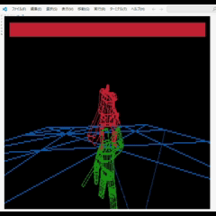
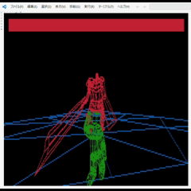

# ターミナル上で動作する３Ｄゲーム
## 成果物
　エルデンリング風の敵の攻撃を回避しながら攻撃を行うゲームを作成。



　ターミナルの文字を限界まで小さくすることでドットとして画像を表示した。

　広く普及している.obj形式の3Dモデルファイルをロードすることが可能であり、Blender等の一般的な3Dモデリングソフトウェアを用いてキャラクターを作成することができる。

```
# ビルド
$ make

# 開始
$ ./main data2.txt
```

## 作成目的
　大学の講義「ソフトウェア工学演習」にて、 **「Ｃ言語でターミナル上で動作するゲーム」** を作成する課題にて制作。

## 工夫点
　初期の段階では動作が重く、ゲームとして遊べる状態で無かったので、アルゴリズムの改善や並列処理等を用いてゲーム体験を向上させた。

　開発環境ではDevContainerを使用した。フォーマッタを導入したことでスムーズに開発を進められたことを実感している。

## 反省点
　授業期間内での作成のため、エラーハンドリングをほとんど行えていない。そのため.objファイルの破損や、読み込みエラーなどに対応することができなかった。

　また、GitHubにはほぼ完成版だけをアップロードしただけであり、適切に運用できていなかった。

## 感想
　満足できる程度の完成度になり、講義内でも最優秀作品に選ばれる等、満足している。が、本来のターミナルならではの文字を用いた表現を活かせていない事が心残りである。
　